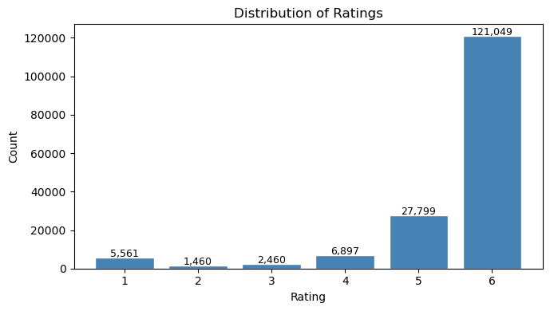
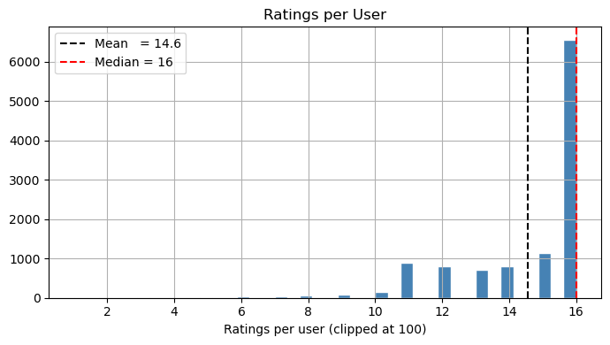
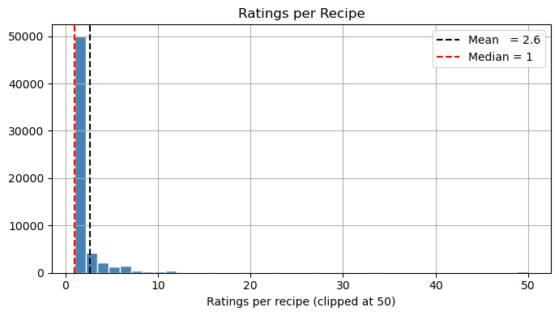
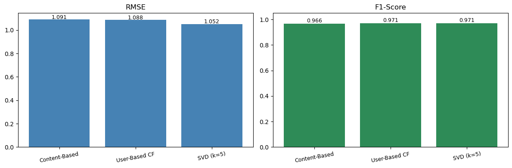

# Recipe Recommendation System

A recipe recommendation system built on the [food.com](https://www.food.com/) dataset, implementing and comparing three recommender approaches: Content-Based Filtering, User-Based Collaborative Filtering, and Matrix Factorization (SVD).

**Course:** Recommendation Tools — IESEG School of Management  
**Instructor:** Fernando DIAZGONZALEZ  
**Author:** Duc Manh NGUYEN

---

## Table of Contents

1. [Project Overview](#project-overview)
2. [Repository Structure](#repository-structure)
3. [Dataset](#dataset)
4. [Exploratory Data Analysis](#exploratory-data-analysis)
5. [Methodology](#methodology)
6. [Results](#results)
7. [Limitations](#limitations)
8. [How to Run](#how-to-run)
9. [Dependencies](#dependencies)

---

## Project Overview

The goal of this project is to build and evaluate three types of recipe recommender systems on real user–recipe interaction data from food.com. For each model, a rating prediction is made for user–recipe pairs not seen during training, and the models are compared using RMSE, MAE, Recall, Precision, and F1 on a held-out test set.

---

## Repository Structure

```
recommendation_project/
├── README.md
├── .gitignore
├── requirements.txt
├── notebook/
│   ├── notebook.ipynb             ← full analysis pipeline
│   └── README.md
└── data/
    ├── train.csv                  ← user–recipe interactions
    ├── metadata.csv               ← recipe metadata
    └── README.md
```

---

## Dataset

Two files make up the dataset.

**`train.csv`** — 165,226 user–recipe interactions with five columns: `user_id`, `recipe_id`, `date`, `rating` (1–6 scale), and a free-text `review`. There are 11,346 unique users and 62,517 unique recipes. No null values or duplicate rows.

**`metadata.csv`** — 231,637 recipe records covering name, preparation time, tags, nutritional values, step-by-step instructions, description, and ingredient list. All 62,517 recipes present in the interaction data have a matching metadata entry.

The data is split 70 / 15 / 15 into train, validation, and test sets (`random_state=42`). The validation set is used only for hyperparameter tuning; the test set is touched once for final evaluation.

---

## Exploratory Data Analysis

### Rating Distribution



Ratings run from 1 to 6 and are heavily skewed toward the maximum. Rating 6 alone accounts for 121,049 interactions — **73.3% of the entire dataset**. This extreme skew has a direct impact on evaluation: any model that predicts values near the global mean (~5.5) will naturally classify almost every interaction as "relevant" and inflate Recall and F1. RMSE is therefore the more reliable primary metric for comparing models.

| Rating | Count | Share |
|:---:|---:|---:|
| 1 | 5,561 | 3.4% |
| 2 | 1,460 | 0.9% |
| 3 | 2,460 | 1.5% |
| 4 | 6,897 | 4.2% |
| 5 | 27,799 | 16.8% |
| 6 | 121,049 | 73.3% |

### Ratings per User



The distribution of ratings per user is left-skewed, with a mean of **14.6** and a median of **16**. The majority of users in this sample are highly active, frequently reaching the 16-rating ceiling. This means user cold-start is largely a non-issue: only 2 users in the validation set and 5 in the test set have zero training history.

### Ratings per Recipe



Recipes tell a very different story. The distribution has an extreme long tail, with a mean of **2.6** but a median of only **1** — more than half of all recipes have been rated exactly once. Over 6,750 recipes in both the validation and test sets have **zero** training ratings (cold-start items), representing roughly 27% of evaluation interactions. This is the single largest challenge in the project, as neighbourhood-based Collaborative Filtering cannot form meaningful neighbours for items with so few ratings.

### Matrix Sparsity

With 11,346 users and 62,517 recipes, the full interaction matrix has 709 million possible cells, of which only 165,226 are filled. That gives a **density of 0.023%** and a **sparsity of 99.97%** — an extremely sparse setting that disadvantages neighbourhood-based methods and favours model-based approaches like SVD.

---

## Methodology

### 1. Content-Based Filtering

Each recipe is represented as a TF-IDF vector (5,000 features, `sublinear_tf=True`, English stop-words removed) built from three text fields concatenated together: **tags**, **ingredients**, and **description**. Cosine similarity between recipe vectors is used as the measure of recipe-to-recipe affinity.

For a given (user, recipe) pair, the prediction is a cosine-similarity-weighted average of the ratings the user has already assigned to the K most similar recipes in the training set (K=10). If the target recipe has no metadata or the user has no training history, the prediction falls back to the global mean (5.50).

The model also supports generating top-N recommendation lists for a user by aggregating similarity scores from their top-rated seed recipes. Sample output for a user who liked baked pasta:

> 1. rigatoni and sausage bake (sim=0.640)
> 2. baked ziti with spinach, sausage, and mozzarella (sim=0.632)
> 3. zippity do dah baked ziti (sim=0.631)

### 2. User-Based Collaborative Filtering

Implemented using `KNNBasic` from the scikit-surprise library with cosine similarity and **k=20 neighbours**. The model builds an 11,346 × 11,346 user similarity matrix from the training ratings and, for each prediction, finds the k nearest users who have also rated the target recipe.

Due to the 99.97% matrix sparsity, the model finds no valid neighbours for **97.1% of validation predictions** and falls back to the global mean. The model is therefore effectively non-personalised on this dataset, acting almost identically to a simple average predictor.

### 3. Matrix Factorization (SVD)

Biased SVD from scikit-surprise decomposes the rating matrix into user and item latent factor matrices, with user and item bias terms (`biased=True`). Because SVD learns from all observed ratings simultaneously rather than looking for local neighbours, it is far more robust to sparse data.

Hyperparameters were tuned on the validation set across 6 combinations:

| n_factors | n_epochs | Val RMSE | Val MAE |
|:---:|:---:|:---:|:---:|
| 5 | **20** | **1.0680** | **0.6635** |
| 20 | 20 | 1.0681 | 0.6635 |
| 5 | 10 | 1.0692 | 0.6815 |
| 20 | 10 | 1.0695 | 0.6811 |
| 50 | 20 | 1.0701 | 0.6666 |
| 50 | 10 | 1.0716 | 0.6834 |

**Best configuration: `n_factors=5`, `n_epochs=20`** (Val RMSE 1.0680). Notably, a small number of latent factors performs best — consistent with the dataset's sparsity, where adding more dimensions only increases noise. The final model was re-fitted on the full training set before test evaluation.

---

## Results

### Test Set Performance



| Metric | Content-Based | User-Based CF | SVD (k=5) |
|---|:---:|:---:|:---:|
| **RMSE** | 1.0907 | 1.0877 | **1.0518** |
| **MAE** | **0.6491** | 0.7253 | 0.6553 |
| Recall (thr=4) | 0.9852 | **0.9999** | 0.9987 |
| Precision (thr=4) | **0.9483** | 0.9437 | 0.9453 |
| F1 (thr=4) | 0.9664 | 0.9710 | **0.9712** |

**SVD is the best overall model**, achieving the lowest RMSE (1.0518) and highest F1 (0.9712). It benefits from learning dense latent representations that generalise across the sparse matrix, rather than relying on direct user-item overlap.

**Content-Based achieves the best MAE (0.6491) and Precision (0.9483).** Its TF-IDF representations allow it to handle cold-start recipes gracefully — when a recipe has few ratings, the model can still predict based on ingredient and tag similarity with items the user has rated. This explains its edge on MAE despite a weaker RMSE.

**User-Based CF is essentially a non-personalised baseline.** Its near-perfect Recall (0.9999) is misleading: with 97.3% of test predictions falling back to the global mean of 5.50, the model predicts "relevant" for almost every pair — making it trivially easy to catch all true positives. Its RMSE (1.0877) and MAE (0.7253) are the weakest of the three on those metrics.

> **Why are all F1 scores above 0.96?** Because 94% of actual ratings are ≥ 4, any model predicting near the global mean will correctly classify nearly every interaction as "relevant." These figures demonstrate that none of the models failed catastrophically, not that they are equally strong recommenders. RMSE and MAE are more informative here.

---

## Limitations

**Rating skew.** 73% of ratings are the maximum (6/6), compressing RMSE differences into a narrow band (1.05–1.09) and inflating all classification metrics. It is difficult to distinguish strong personalisation from a smart default predictor.

**Extreme item sparsity (median = 1 rating per recipe).** This is the primary reason User-Based CF fails. Over 10,800 recipes in the evaluation splits have zero training ratings. Collaborative methods need sufficient overlap to find meaningful neighbours; that overlap barely exists here.

**Review text not used.** Every interaction includes a free-text review. Sentiment extracted from these reviews — or even basic keywords — could substantially improve all three models without requiring additional data.

**TF-IDF semantic limitations.** Vocabulary overlap is a weak proxy for culinary similarity. "Pasta bake" and "macaroni gratin" share almost no tokens yet describe essentially the same dish. Pre-trained embeddings (Word2Vec, BERT) would capture these relationships far more accurately.

---

## How to Run

```bash
# Clone and enter the repo
git clone https://github.com/<your-username>/recipe-recommendation-system.git
cd recipe-recommendation-system

# Create and activate environment
conda create -n rec_system python=3.10 -y
conda activate rec_system
pip install -r requirements.txt

# Place data files in the data/ folder, then launch the notebook
jupyter notebook notebook/notebook.ipynb
```

Run all cells with **Kernel → Restart & Run All**. Expected runtime: 3–5 minutes (the TF-IDF validation loop and SVD tuning grid are the slowest steps).

---

## Dependencies

| Package | Purpose |
|---|---|
| `pandas` | Data loading and manipulation |
| `numpy <2.0` | Numerical operations |
| `scikit-learn` | TF-IDF vectorisation, cosine similarity, train/test splitting |
| `matplotlib` | EDA and results visualisation |
| `scikit-surprise` | KNNBasic (CF) and SVD (Matrix Factorization) |

See `requirements.txt` for pinned versions.
